#[fit]15 minutes avec l'équipe Caradisiac

^ Comme vous pouvez le voir, c'était plutôt éprouvant...<br />
C'était 15 minutes avec l'équipe Caradisiac<br />
Merci de nous avoir écouté

---


^ On cherchait une image de fond pour notre présentation<br />
Google Images "Caradisiac"

---

# TL;WL:

---

# Plan

---

# On se présente

---

# Caradisiac s'intègre dans le PEM CBM

- Comment ça marche niveau projet
- L'équipe (Xebia + CD)
- 0 Coach Agile
- Le dispositif

---

# Intro

- Durée du projet
- Contexte (Plateformes: web, utilisateurs, Cordova)
- But
- Montrer phonegap
- iOS: Alexis

---

# La méthodo

- Les sprints (1 semaine)
- Daily 0, Rétro 0
- Démo (Chromecast, Apple TV)
- Piloté avec XL (Excel)
- Magic estimation => CnV
- Outils agiles

---

# Les devs

- Complexité des WS XML et JSON
- Comment on construit la page
- iOS (KIF) (S)
- Android (Spoon / Sonar) (G)
- Analytics
- Les modifs WS: le lendemain en prod (devops au top)
	- En fait... Coda

---

# Les services web

## La compléxité

---

# Les services web

## Du XML qui n'en est pas

```
<commentaire>
  <line>
     Salut <smiley mnemo=":hello:"/> les gamins <smiley mnemo=":lol:"/> !
  </line>
</commentaire>
```

> T'façon *<![CDATA[]]>* ça sert à rien

^ [G]
Leurs WS contiennent des balises XML à des endroits qui devraient contenir du texte<br />
En plus de nous filer les WS sans content-type ils nous filent des XML invalides
Ça serait trop facile sinon

---


^ [G]
Mais du coup, sur Android j'ai 15 services en XML... et 1 en JSON<br />
Connards<br />
Sur iOS le ratio XML/JSON, c'est du 50/50

---

# Les services web

- REST-like (mais pas RESTful)
- XML + JSON
 - content-type="text/plain"
 - Tous les services sont en XML
 - La moitié aussi dispo en JSON
 - 1 WS est en JSON uniquement

^ [G]
REST pour faire joli, pas pour Joachim<br />

---

# La recette

---

- Release Android réportée (G) // TODO

---

# La recette

## [fit] 10 minutes

---

# La recette

## ~~1 sprint~~
## ~~1 jour~~
## ~~1 heure~~
## 10 minutes

---

# La recette

## ~~1 sprint~~
## ~~1 jour~~
## 1 heure

---

# La recette

## ~~1 sprint~~
## 1 jour

---

# La recette

## ~~1 sprint~~

## Nous sommes agiles !

---

# La recette

## 1 sprint

---

# Fin projet

---

# La rétro
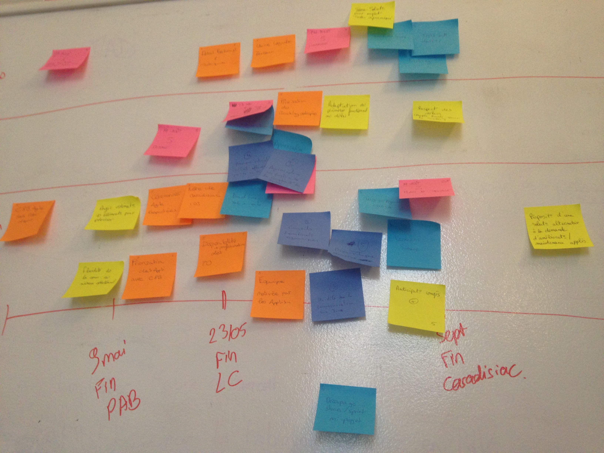

---

# Le résultat / Android

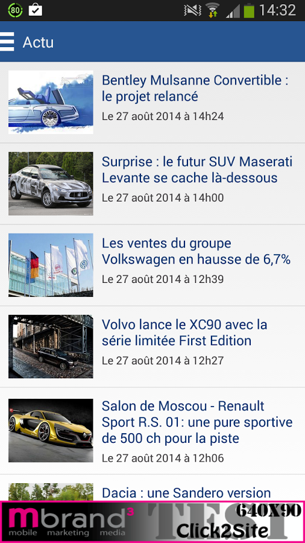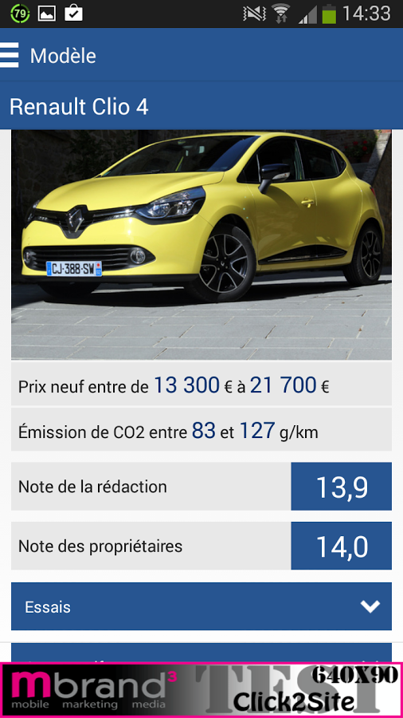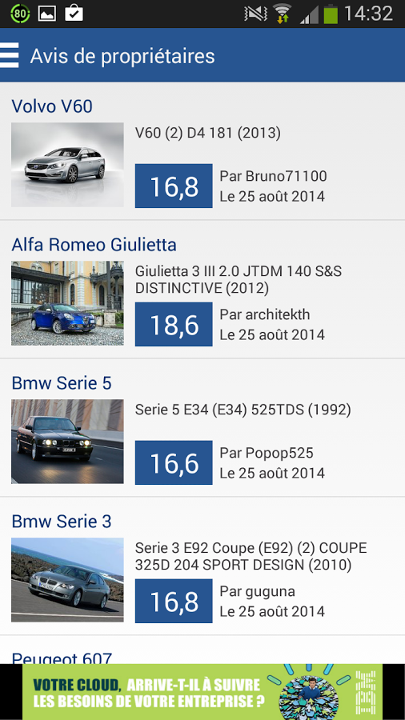

^ Bannières dans les screenshots

---

# Le résultat / iOS

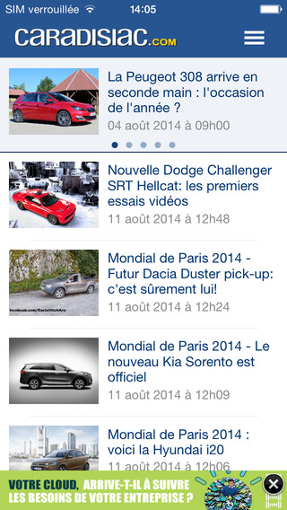.jpeg)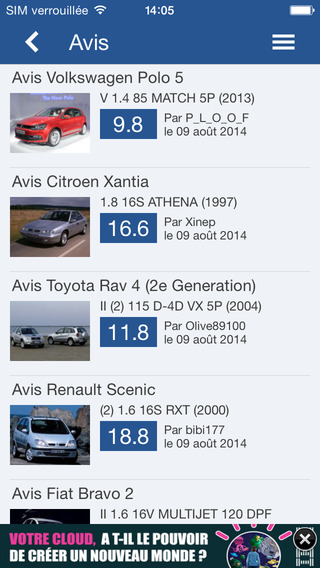

---

# Applis sur les Stores

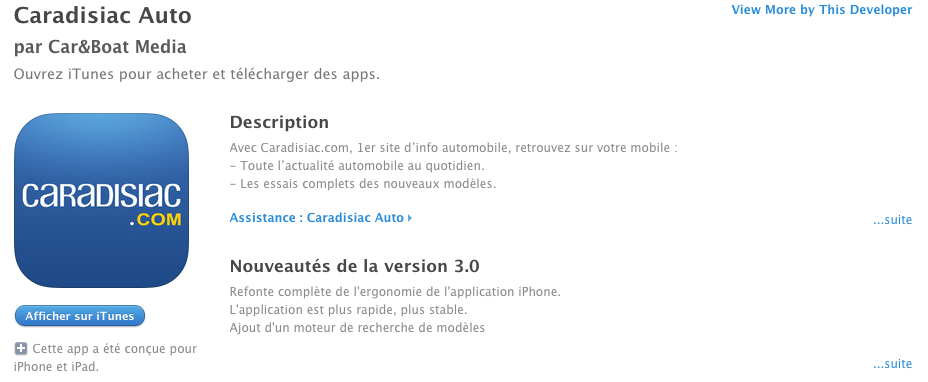


---

# Publicité


---

# Publicité

## [fit] Caradisiac :heart: Pub

^ [S] C'est une grande histoire d'amour

---

# Commentaires positifs

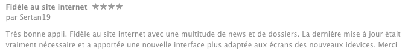
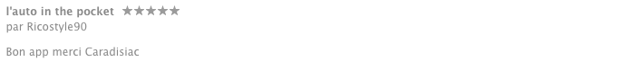


^Linette est Aline

---

# Commentaires positifs

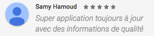
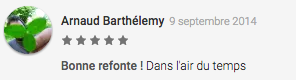

^ [S] A tel point qu'elle apparaît même dans les captures d'écran du store

---

# Conclusions

---

TODO

---

# Merci

---

# Merci


^ Vous êtes vraiment un public formidable

---

# Questions ?

^ On a pas/plus le temps pour les questions

