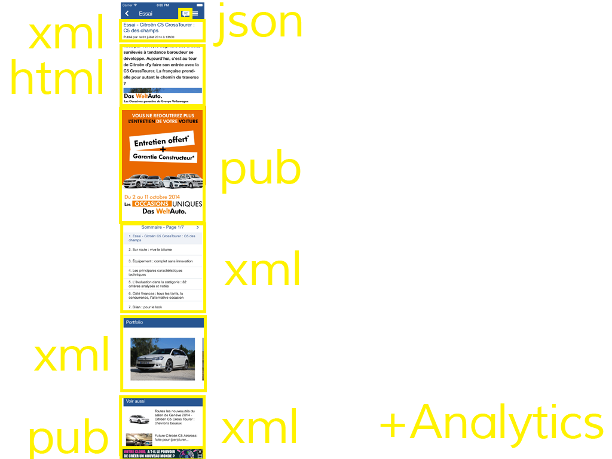
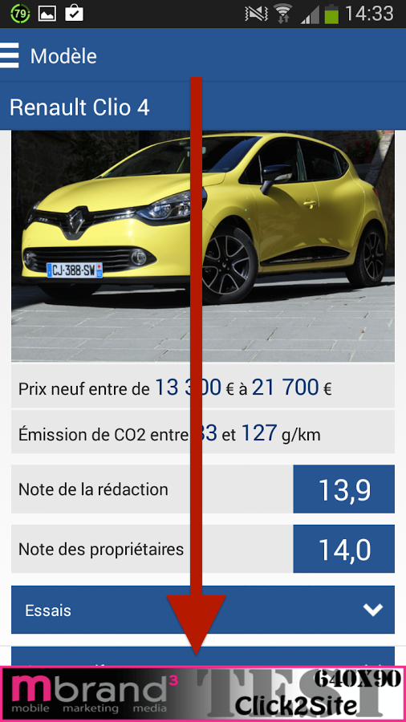

slidenumbers: true


#[fit]15 minutes avec l'équipe Caradisiac

^ Comme vous pouvez le voir, c'était plutôt éprouvant...<br />
C'était 15 minutes avec l'équipe Caradisiac<br />
Merci de nous avoir écouté

---


^ [G]
Ce que vous pouvez aussi retenir, c'est ce que renvoie la recherche Google Images pour Caradisiac

---

# TOO LONG; WON'T LISTEN:

- Pôle d'Expertise Mobilité - Xebia Studio
- Sprints Scrum d'une semaine
- Complexité des services web
- La recette
- Application sortie et bien notée

^ [G]
Mais ce qu'il faut retenir

---

# Plan

^ [G]
Le plan...
Alors on a parlé de plein de trucs cools

<La flemme,
Personne lit ça>

---

# On se présente


https://twitter.com/viteinfinite

https://plus.google.com/+GautierMechling

^ [G]
Et on a oublié de se présenter<br />
Lui c'est Simone, il fait de l'iOS
Et moi Gautier sur Android<br />
On est consultant chez Xebia

---

# TMA Car&Boat Mobilité


^ [G]
En vrai on appelle ça de la TMA. C'est un projet Studio supervisé par François Laurain<br />
On a un interlocuteur de leur côté, le PO<br />
J'ai pas trouvé de photo de notre PO, mais il ressemble un peu à un ours mignon donc voila, c'est lui<br />

---

# Les besoins Android
# Pôle d'Expertise Mobilité


^ [G]
On était dans ce que Thibaud appelle intelligemment le PEM CBM.<br />
C'est un contrat sur 1 an où Xebia doit developper et maintenir leurs applications mobiles<br />
C'est plutôt cool

---

# Notre coach agile


^ [G] Qui est l'heureux gagnant ?<br />
D'ailleurs il est dans la salle ou pas ? (chercher dans la salle)<br />
Non... normal on en avait pas

---

# Intro


---

# Les besoins iOS


^[S]

---

# Les besoins iOS


^[S]

---

# Les besoins, recap


^[S]
// TODO: photo ou vidéo vrai applis iOS et Android sur device

---

# La méthodo

^ [S]

---


---

# La méthodo

## La rétro
### En fin de sprint

^ [S]
Et tous ceux qui participaient à la retro

---


---

# La méthodo

## Daily
### tous les jours

^ [S] Généralement on fait un daily tous les jours
Avec plein de monde
Nous avons pris une photo du monde à nos dailies

---

# La méthodo

## Durée du sprint
### 1 semaine

^ [S]

---

# La méthodo

## Démo


^ [S]

---

# La méthodo

## Démo


^ [S]

---

# La méthodo

## Magic Cycle en V

---


^ [S]

---

# La méthodo

## Magic estimation

^ [S]

---

# La méthodo

## Pilotage avec eXceL


^ [S]
Oui Excel, l'outil agile

---

# La méthodo

## Pilotage avec XL


^[S]
Au niveau de la méthodo, on a pris le choix de tout piloter par Excel<br />
[G]
- "éxel", pas "ixel"

---


^[S]
- Devops est au top

---


^[S]
car le code des WS est savoureux
alt: http://i.giphy.com/5MNqK3rQNl1Ze.gif

---

# Les outils


^[S]
La qualité du code de l'appli ne nous preouccupe pas trop...
Car lé deploiement chez le client

---

# Les outils


^[S]

---

# Les outils


^[S]
Mais heureusement qu'on a des bonnes outils

---

# La page de détail



^ [S]
// TODO : ajouter la pub plein écran

---

# La page de détail


^ [S]
Comme par exemple dans cette page de détail

---

# Les services web


^ [S]
Dans certains écrans de l'application, il faut appeler jusqu'à 8 services en même temps pour avoir les bonnes informations

---


^ [G]
Voila c'est cet espèce de truc déguelasse à parser qu'on a en permanence

---


^ [G]
Non pas ça

---

# Les services web

## La compléxité

Actuellement

```
<result>
  <_connexion_db>OK</_connexion_db>
  <_erreurs/>
  <_data>
    <tag label="Clio 3" url="modele--renault-clio-3">
    <tag label="Renault" type="brand"/>
    <tag label="Clio" type="model"/>
    <logo path="/logos-ref/modele">modele--renault-clio-3.jpg</logo>
  </_data>
</result>
```

- Nom: *tag[type="brand"] + " " + tag[url="<url>"]*
- Image: *"http://images.caradisiac.com" + logo[path] + "/S5-" + logo*

^ [G]
En vérité c'est plutôt comme ça
Il faut retrouver dans le XML plein de valeurs et les concaténer entre elles<br />
[expliquer concatenation]<br />
Et encore, on a simplifié pour l'exemple parce qu'en vrai c'est plutôt ça

---

# Les services web

## La compléxité


Idéalement

```
<model name="Renault Clio 3"
  image="logos-ref/modele/modele--
    renault-clio-3/S5-modele--renault-clio-3.jpg" />
```

^ [G]
Et puis tant qu'à faire, autant les rendre super compliqués à utiliser<br />
Idéalement pour l'écran suivant j'ai besoin d'un WS avec champ pour le nom du modèle : "Renault Clio 3" et l'url de l'image<br />
Normal quoi

---

# Les services web

## Du XML qui n'en est pas

```
<commentaire>
  <line>
     Salut <smiley mnemo=":hello:"/> les gamins <smiley mnemo=":lol:"/> !
  </line>
</commentaire>
```

> *<![CDATA[]]>* ? Connaît pas

^ [G]
En plus de ça leurs WS XML sont invalides<br />
Ils contiennent des tags à des endroits qui ne devraient pas en contenir<br />
Ça serait trop facile sinon

---

# Les services web

- REST-like (mais pas RESTful)
- XML + JSON
 - content-type="text/plain"
 - Tous les services sont en XML
 - La moitié aussi dispo en JSON
 - 1 WS est en JSON uniquement

^ [G]
- Leurs services web, on va dire qu'ils sont en REST
- Avec un content-type incorrect sinon ça serait trop simple
- Tous leurs services web sont en XML sauf 1
- Du coup t'es obligé côté code de faire une stack qui gère à la fois XML et JSON

---

# La recette

^ [G]
Par contre un truc qu'on aime pas, c'est leurs Services Webs

---

# La recette


^ [G]
Mais bon c'est le client, c'est lui qui nous paye et du coup on l'aime bien quand même.

---

# La recette


^ [G]
Et me fait EXACTEMENT le même coup la semaine suivante

---

# La recette


^ [G]
Il teste que dalle pendant 1 mois, reporte la release parce qu'il teste le jour même

---

# La recette


^ [G]
Je me fais chier à sortir son app dans les temps (qui sont déjà ultra courts)

---

# La recette


^ [G]
Résultat : Release Android reportée d'un sprint<br />
Vous imaginez ma réaction

---

# La recette


^ [G]
Ça c'est un peu la réaction de notre PO quand il s'est rendu compte qu'une story correspondait pas à ce qu'il attendait pendant cette recette.
Bien sûr il avait pas écrit les BDD de ce qu'il souhaitait vraiment et avait validé la story il y a 1 mois de cela

---

# La recette

^ [G]
Et le jour de la release
Sinon c'est pas drôle

---

# La recette

## [fit] 10 minutes

^ [G - S]
"La recette : 10 minutes !"

---

# La recette

## ~~1 sprint~~
## ~~1 jour~~
## ~~1 heure~~
## 10 minutes

^ [S]

---

# La recette

## ~~1 sprint~~
## ~~1 jour~~
## 1 heure

^ [S]

---

# La recette

## ~~1 sprint~~
## 1 jour

^ [S]

---

# La recette

## 1 sprint

^ [S]
...et nous on fait pas de recette d'un sprint

---

# La recette

## Nous sommes agiles !

^ [S]
Nous sommes agiles...

---

# Fin projet

^ [S]

---

# La rétro


^ [S]
...et la rétro de fin projet

---

# [fit] :heart:


^ [S]
...comme nous aimons les pratiques agiles

---

# Publicité

## [fit] Caradisiac :heart: Pub

^ [S]
Eh oui, Caradisiac aime la pub

---

# Publicité


^[S]
...partout

---

# Publicité


^[S]
...partout

---

# Publicité



^[S]
Au fait... Il y a de la pub partout

---


^ [S]
Une grande histoire d'amour...
Mais comme beaucoup d'histoires d'amour, elles peuvent mal tourner

---

## [fit] :heart::heart::heart::heart::heart:

# [fit] Publicité

^ [S]
En fait la pub chez Caradisiac c'est plutôt grande histoire d'amour

---

## [fit] :star::star::star::star::star:

# [fit] Publicité

^ [S]
Dont la pub!

---

## [fit] :star::star::star::star::star:

^ [S]
Les commentaires positifs c'est surtout grâce aux fonctionnalités exclusives de l'application

---

# Commentaires positifs


^ [S]
Linette; le DP s'appelle Aline, probablement une omonime

---

# Commentaires positifs


^ [S]
Voici d'ailleurs quelques commentaires sur les stores
A tel point qu'elle apparaît même dans les captures d'écran du store

---

# Les applis sur les Stores


^ [S]
Malgré l'icône nous avons même eu des commentaires positifs

---

# L'appli / Android


^ [S]
Bannières dans les screenshots

---

# L'appli / iOS


^ [S]

---

# Conclusions

---

TODO

---

# Merci

^ [G]
On va vous parler de Caradisiac, une appli de news auto (comme turbo ou auto plus) qu'on a réalisé et qu'on a sorti dernièrement


---

# Merci


^ [G]
Mais merci d'être venus si nombreux<br />
[? autre]
Même si vous aviez pas trop le choix<br />
[?]
Vous êtes vraiment un public formidable

---

# Questions ?

^ [G]
OK, On aura pas le temps pour les questions
