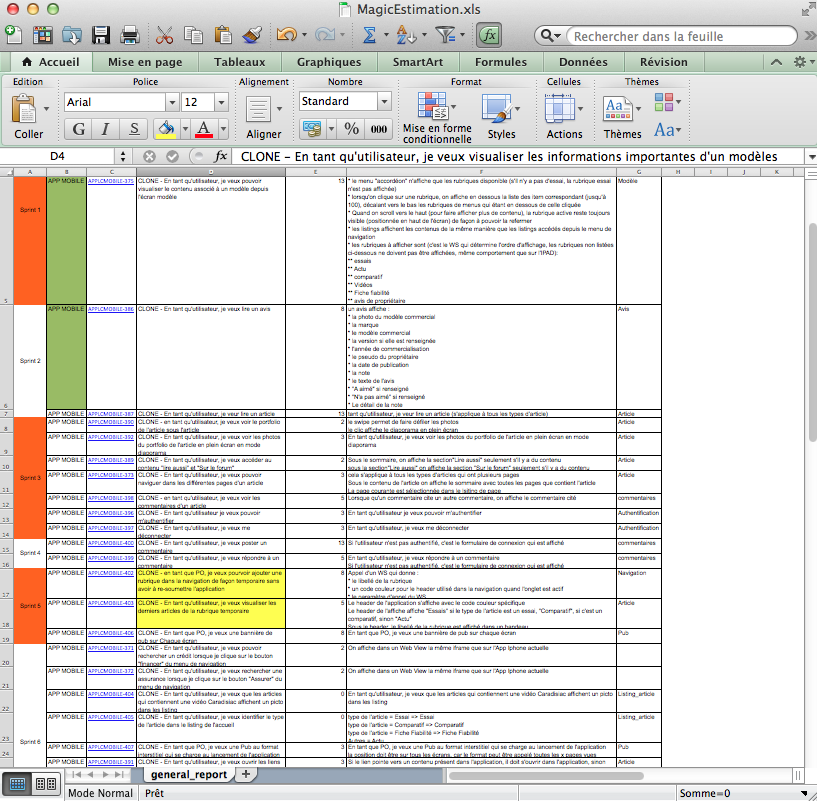

#[fit]15 minutes avec l'équipe Caradisiac

^ Comme vous pouvez le voir, c'était plutôt éprouvant...<br />
C'était 15 minutes avec l'équipe Caradisiac<br />
Merci de nous avoir écouté

---


^ On cherchait une image de fond pour notre présentation<br />
Google Images "Caradisiac"

---

# TL;WL:

---

# Plan

---

# On se présente

---

# Caradisiac s'intègre dans le PEM CBM

- Comment ça marche niveau projet
- L'équipe (Xebia + CD)
- 0 Coach Agile
- Le dispositif

---

# Intro

- Durée du projet
- Contexte (Plateformes: web, utilisateurs, Cordova)
- But
- Montrer phonegap
- iOS: Alexis

---

# La méthodo

^ [S]

---

# La méthodo

## La rétro
### En fin de sprint

^ [S]
Pour la rétro... euh... y'a pas de rétro

---

# La méthodo

## Daily
### tous les jours

^ [S] Généralement on fait un daily tous les jours
Et bien nous, on en faisait jamais

---

# La méthodo

## Durée du sprint
### 1 semaine

^ [S]

---

# La méthodo

## Démo


^ [S]

---

# La méthodo

## Démo


^ [S]

---

# La méthodo

## Magic Cycle en V

---


^ [S]

---

# La méthodo

## Magic estimation

^ [S]

---

# La méthodo

## Pilotage avec eXceL



^ [S]
Oui Excel, l'outil agile

---

# La méthodo

## Pilotage avec XL


^[S]
Au niveau de la méthodo, on a pris le choix de tout piloter par Excel<br />
[G]
- "éxel", pas "ixel"

---

//TODO: [S] iOS Code très peu spécifique 

---

# Les devs

- Complexité des WS XML et JSON
- Comment on construit la page
- iOS (KIF) (S)
- Android (Spoon / Sonar) (G)
- Analytics
- Les modifs WS: le lendemain en prod (devops au top)
	- En fait... Coda

^ [S]

---

# Les services web


^ [S]
Dans certains écrans de l'application, il faut appeler jusqu'à 8 services en même temps pour avoir les bonnes informations
*TODO: transition sur l'avantage de leur déploiement rapide*
L'avantage, c'est que si on a besoin d'un changement dans un WS c'est en prod le lendemain<br />
DevOps les mecs ils sont au top<br />
En fait... Coda

---


^ [G]
Voila c'est cet espèce de truc déguelasse à parser qu'on a en permanence

---


^ [G]
Non pas ça

---

# Les services web

## La compléxité

Actuellement

```
<result>
  <_connexion_db>OK</_connexion_db>
  <_erreurs/>
  <_data>
    <tag label="Clio 3" url="modele--renault-clio-3">
    <tag label="Renault" type="brand"/>
    <tag label="Clio" type="model"/>
    <logo path="/logos-ref/modele">modele--renault-clio-3.jpg</logo>
  </_data>
</result>
```

- Nom: *tag[type="brand"] + " " + tag[url="<url>"]*
- Image: *"http://images.caradisiac.com" + logo[path] + "/S5-" + logo*

^ [G]
En vérité c'est plutôt comme ça
Il faut retrouver dans le XML plein de valeurs et les concaténer entre elles<br />
[expliquer concatenation]<br />
Et encore, on a simplifié pour l'exemple parce qu'en vrai c'est plutôt ça

---

# Les services web

## La compléxité


Idéalement

```
<model name="Renault Clio 3"
  image="logos-ref/modele/modele--
    renault-clio-3/S5-modele--renault-clio-3.jpg" />
```

^ [G]
Et puis tant qu'à faire, autant les rendre super compliqués à utiliser<br />
Idéalement pour l'écran suivant j'ai besoin d'un WS avec champ pour le nom du modèle : "Renault Clio 3" et l'url de l'image<br />
Normal quoi

---

# Les services web

## Du XML qui n'en est pas

```
<commentaire>
  <line>
     Salut <smiley mnemo=":hello:"/> les gamins <smiley mnemo=":lol:"/> !
  </line>
</commentaire>
```

> *<![CDATA[]]>* ? Connaît pas

^ [G]
En plus de ça leurs WS XML sont invalides<br />
Ils contiennent des tags à des endroits qui ne devraient pas en contenir<br />
Ça serait trop facile sinon

---

# Les services web

- REST-like (mais pas RESTful)
- XML + JSON
 - content-type="text/plain"
 - Tous les services sont en XML
 - La moitié aussi dispo en JSON
 - 1 WS est en JSON uniquement

^ [G]
- Leurs services web, on va dire qu'ils sont en REST
- Avec un content-type incorrect sinon ça serait trop simple
- Tous leurs services web sont en XML sauf 1
- Du coup t'es obligé côté code de faire une stack qui gère à la fois XML et JSON

---

# La recette

^ [G]
Par contre un truc qu'on aime pas, c'est leurs Services Webs

---

# La recette


^ [G]
Mais bon c'est le client, c'est lui qui nous paye et du coup on l'aime bien quand même.

---

# La recette


^ [G]
Et me fait EXACTEMENT le même coup la semaine suivante

---

# La recette


^ [G]
Il teste que dalle pendant 1 mois, reporte la release parce qu'il teste le jour même

---

# La recette


^ [G]
Je me fais chier à sortir son app dans les temps (qui sont déjà ultra courts)

---

# La recette


^ [G]
Résultat : Release Android reportée d'un sprint<br />
Vous imaginez ma réaction

---

# La recette


^ [G]
Ça c'est un peu la réaction de notre PO quand il s'est rendu compte qu'une story correspondait pas à ce qu'il attendait pendant cette recette.
Bien sûr il avait pas écrit les BDD de ce qu'il souhaitait vraiment et avait validé la story il y a 1 mois de cela

---

# La recette

^ [G]
Et le jour de la release
Sinon c'est pas drôle

---

# La recette

## [fit] 10 minutes

^ [G - S]
"La recette : 10 minutes !"

---

# La recette

## ~~1 sprint~~
## ~~1 jour~~
## ~~1 heure~~
## 10 minutes

^ [S]

---

# La recette

## ~~1 sprint~~
## ~~1 jour~~
## 1 heure

^ [S]

---

# La recette

## ~~1 sprint~~
## 1 jour

^ [S]

---

# La recette

## ~~1 sprint~~

## Nous sommes agiles !

^ [S]

---

# La recette

## 1 sprint

^ [S]

---

# Fin projet

^ [S]

---

# La rétro


^ [S]

---

# Le résultat / Android


^ [S]
Bannières dans les screenshots

---

# Le résultat / iOS


^ [S]

---

# Applis sur les Stores


^ [S]

---

# Publicité


^ [S]

---

# Publicité

## [fit] Caradisiac :heart: Pub

^ [S]
C'est une grande histoire d'amour

---

# Commentaires positifs


^ [S]
Linette est Aline

---

# Commentaires positifs


^ [S]
Voici d'ailleurs quelques commentaires sur les stores
A tel point qu'elle apparaît même dans les captures d'écran du store

---

# Conclusions

---

TODO

---

# Merci

^ [?]
On va vous parler de Caradisiac, une appli de news auto (comme turbo ou auto plus) qu'on a réalisé et qu'on a sorti dernièrement


---

# Merci


^ [?]
Mais merci d'être venus si nombreux<br />
[? autre]
Même si vous aviez pas trop le choix<br />
[?]
Vous êtes vraiment un public formidable

---

# Questions ?

^ [?]
On aura pas le temps pour les questions
